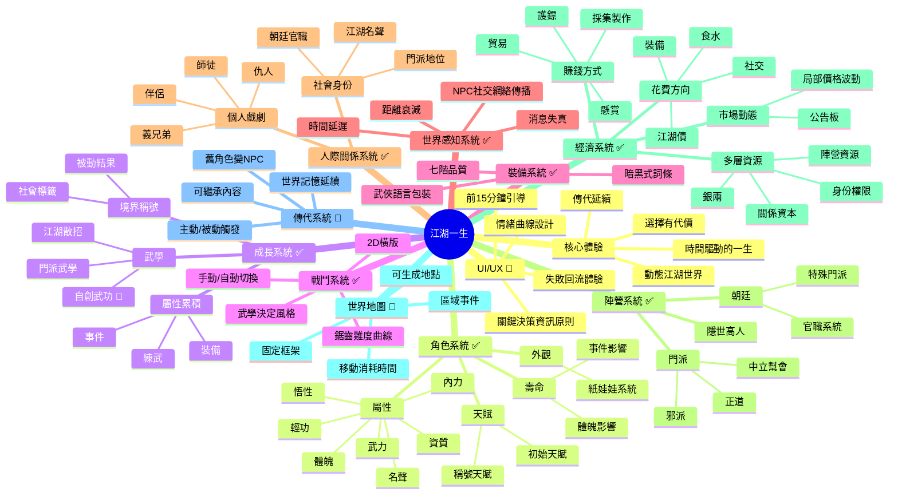

# 策劃草稿：遊戲概念設計與系統腦圖
*陳品霖 | 2026-05-11 | 狀態：待審核*

---

好的，製作人。

我是品霖。文件我讀完了，GDD摘要、對焦紀錄，都收到了。

關於對焦紀錄裡我上次問的蠢問題（A4戰鬥定位已在GDD第10章），我記住了。下次執行任務前，我會把GDD當作聖經來讀，不會再犯。

我理解你對我的期待：**「先設計好玩的，再評估能不能做」**。這個原則我很清楚，也會貫徹到底。

以下是我根據現有資訊，為《江湖一生》梳理的遊戲概念設計與系統腦圖。

---

## Part 1：《江湖一生》遊戲概念設計

### 1. 遊戲基本框架

- **類型**：武俠沙盒生涯RPG
- **平台**：PC (Steam)
- **視角**：世界地圖 + 2D橫版戰鬥/事件場景
- **核心機制一覽**：
    - **時間驅動**：以「日」為最小單位，角色一生（約60-80年）為一局。
    - **屬性成長**：7大核心屬性（武力、內力、體魄、輕功、資質、悟性、名聲）決定一切。
    - **選擇與後果**：玩家行為產生即時與長遠影響，無S/L回溯。
    - **動態世界**：NPC有自己的生活、記憶與社交網絡，世界會因玩家行為改變。
    - **傳代系統**：角色死亡後，玩家可操控其後代，世界記憶延續。

### 2. 核心玩法

- **玩家每天做什麼？**
    1.  **看地圖，選目標**：打開世界地圖，決定今天要去哪個城鎮、哪個門派、哪片野外。
    2.  **移動與遭遇**：選擇移動路徑，消耗遊戲內時間。路上可能觸發隨機事件（山賊打劫、高人指點、仇家埋伏）。
    3.  **執行行動**：到達目的地後，進行核心行為——練武（提升屬性）、社交（拜訪/送禮/結交）、任務（護鏢/懸賞）、探索（尋寶/採集）、戰鬥（切磋/廝殺）。
    4.  **見證後果**：你的行為會即時反映在NPC的對話、關係變化、消息傳播上。你可能會在酒館聽到別人談論你昨天做的事。
    5.  **日結算**：消耗食物、處理狀態、查看信件與傳聞。

- **一局遊戲怎麼進行？**
    1.  **創角**：選擇天賦、自定義外觀，踏入江湖。
    2.  **成長期**（前30年）：摸索世界、拜師學藝、結交朋友、建立名聲。
    3.  **巔峰期**（30-50歲）：實力與人脈達到頂點，開始影響門派格局、參與武林大事。
    4.  **衰退期**（50歲後）：體魄開始下滑，面對年輕一輩的挑戰，思考傳承與歸宿。
    5.  **終局**：角色壽終正寢，或在某次重大戰鬥中隕落，觸發傳代或遊戲結束。

- **什麼讓玩家停不下來？**
    - **「再過一個月就好了」的循環**：武功快練成了、仇家就在隔壁城、拍賣會明天開始……時間壓力與機會窗口交織。
    - **「我想看看會發生什麼」的好奇心**：送給掌門的禮物會有什麼反應？拒絕那個女人的求婚會怎樣？每個選擇都是一個鉤子。
    - **「這是我獨一無二的故事」的成就感**：你的經歷、你的仇人、你的傳奇，是無法被複製的。你是在寫一本屬於自己的武俠小說。

### 3. 故事背景

- **時代**：明朝洪武年間。天下初定，舊元勢力仍在北方虎視眈眈。朝廷忙於鞏固皇權，江湖秩序尚未完全建立，正邪模糊，是一個充滿機遇與混亂的「英雄時代」。
- **世界觀**：純粹的武俠世界。沒有神仙鬼怪，沒有靈氣復甦。一切力量源於自身武學修養與智慧。江湖的規則是「拳頭大」和「名聲響」，但背後還有朝廷的律法、門派的規矩、人情的牽絆。
- **玩家身份**：一個初入江湖的普通人。沒有血海深仇的預設背景，你的身份由你的第一個選擇和後續的行為定義。你可以成為大俠、惡棍、商人、鏢師、隱士……一切皆有可能。
- **世界的運作規則**：
    - **物理規則**：人會老、會死。輕功再好不能飛，內力再強不能隔空取物。
    - **社會規則**：名聲決定你的社交地位。朝廷、門派、幫會是三大勢力主體，各有利益與衝突。
    - **信息規則**：消息靠人傳，有距離和時間延遲。你在偏遠山村做的事，京城可能要幾個月後才知道。

### 4. 四大核心支柱（遊戲中的體現）

1.  **這是我的一生**：你從少年到白頭，能清晰地感受到時間在身上留下的痕跡。體魄隨年齡下降，臉上的皺紋增多，江湖上的朋友從一起喝酒到相繼離世。你的一生不是任務鏈，而是由無數選擇交織成的獨特傳記。

2.  **選擇有代價**：沒有「兩全其美」的選項。救了這個村莊，就來不及去救另一個朋友。選擇加入武當，就等於放棄了與明教交好的機會。每個重要選擇都會關閉另一扇門，而這個關閉的動作，會讓世界產生連鎖反應。

3.  **江湖有人**：NPC不是任務發布機。他們有自己的名字、性格、目標和社交圈。你救過的鐵匠會在你受傷時給你打折；你得罪過的掌門會派弟子找你麻煩。他們會記得你對他們做過的事，也會把這些事告訴他們的朋友。這個世界因為這些「活人」而充滿人情味與不確定性。

4.  **時間可見**：世界不是靜止的。你練功的這幾個月，隔壁門派可能發生了內鬥；你遠走他鄉的這幾年，你的仇人可能已經壯大。時間會改變一切——人的實力、勢力的強弱、物品的價值。你必須在時間的洪流中做出判斷，因為機會稍縱即逝。

### 5. 與競品的差異

- **vs. 鬼谷八荒**：
    - **本質差異**：鬼谷是「修仙模擬器」，核心是「逆天改命，突破境界」；《江湖一生》是「人生模擬器」，核心是「在有限的時間裡，體驗一段江湖人生」。
    - **具體表現**：鬼谷的壽命壓力是修仙失敗；我們的壽命壓力是「人生苦短，遺憾難免」。鬼谷的NPC是隨機生成的工具人；我們的NPC是會記憶、會成長、會與世界互動的「江湖人」。

- **vs. 龍胤立志傳**：
    - **本質差異**：龍胤是「策略角色扮演」，其深度在於複雜的系統疊加與門派經營；《江湖一生》是「敘事角色扮演」，其深度在於個人故事的戲劇性與情感衝擊。
    - **具體表現**：龍胤的玩法是「經營與管理」；我們的玩法是「體驗與選擇」。龍胤的樂趣在於「我打造了一個強大的勢力」；我們的樂趣在於「我經歷了一段刻骨銘心的江湖恩怨」。

- **我們的核心差異**：**「世界感知」與「傳代系統」**。前者讓玩家的行為透過時間與空間被世界真實地感知與回應，後者讓玩家的故事可以跨越世代，讓江湖真正擁有「記憶」。這是我們區別於所有競品的殺手鐧。

### 6. 靜怡（UX）補充要求

- **玩家情緒旅程曲線**：
    - **前期（0-5小時）**：**好奇與探索**。引導明確，選擇後果清晰（例如：幫A派，B派立刻降低好感）。**張力**來自於「下一個鎮子會有什麼？」。**釋放**來自於第一次成功打敗強敵、第一次與NPC建立深刻關係。
    - **中期（5-30小時）**：**投入與糾結**。世界開放，選擇開始變得兩難。**張力**來自於「我該報仇還是放下？」、「我該忠於門派還是忠於朋友？」。**釋放**來自於做出選擇後的劇情展開、實力突破後的爽感。
    - **後期（30小時+）**：**回顧與傳承**。角色步入老年，世界格局已定。**張力**來自於「我這一生留下了什麼？」、「我的孩子能否繼承我的意志？」。**釋放**來自於傳代時的回顧總結、看到自己的故事在江湖上流傳的滿足感。

    **避免迷失感的核心手段**：**「目標引導」代替「任務引導」**。系統不發任務，而是透過NPC的閒聊、告示板、江湖傳聞，為玩家提供「可選的目標」。「聽說華山派掌門在找一本失傳的劍譜」→ 這不是任務，這是一個你可以去追求的目標。

- **關鍵決策的資訊原則**：
    - **玩家能看到的**：選擇的「方向」與「代價類型」。例如，投師時：「拜入武當（正派、內功見長，但規矩森嚴）」vs. 「拜入丐幫（自由、消息靈通，但生活清苦）」。
    - **玩家不能看到的**：選擇的「精確後果」與「長遠影響」。你永遠不知道送給掌門的禮物會讓他對你提升多少好感度，也不知道你今天放過的那個山賊，十年後會不會成為一方霸主。
    - **原則**：給玩家足夠的資訊做出「有意義的選擇」，但不給「最佳解」的資訊。讓選擇基於價值觀和直覺，而非算計。

- **失敗與死亡後的回流體驗**：
    - **戰鬥失敗**：不一定是死亡。可能是重傷、被俘、丟失財物。系統會給出清晰的失敗原因（「對方武力高出你30點」），並提供多種後果選項（「花錢消災」、「屈辱求和」、「拼死一搏」）。
    - **角色死亡**：這是一局的結束，不是遊戲的結束。死亡後，進入「生平回顧」畫面，用卷軸或書頁的形式，總結角色一生的重大事件、成就、關係。情緒是「感慨與回味」，而非「沮喪與憤怒」。
    - **死亡後的選擇**：立即開始新一局（新角色、新世界）或進行傳代（繼承部分遺產，在同一個世界繼續）。確保玩家永遠有一個正向的「下一步」可以走。

- **前15分鐘資訊密度控制**：
    - **第0-5分鐘**：創角、看開場劇情、做出第一個簡單選擇（例如：向左走向右走？）。
    - **第5-10分鐘**：經歷第一場戰鬥（操作教學隱藏在UI提示中）、遇到第一個重要NPC（對話有選項）。
    - **第10-15分鐘**：體驗第一個選擇的後果（NPC態度變化、獲得/失去某個物品）。世界地圖解鎖，但只顯示附近區域。
    - **延後出現的系統**：裝備詞條（只在獲得第一件「精良」裝備時提示）、傳代系統（只在角色年齡超過40歲或觸發相關事件時解鎖）、門派政治（只在加入門派後逐步開放）。**讓玩家先「玩起來」，再「學規則」**。

---

## Part 2：系統腦圖（Mermaid 格式）

